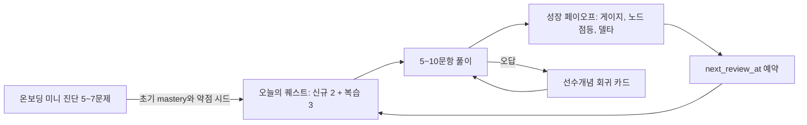

# EduHelp_AI 최종 실행 계획서

고등 수학 학습 MVP를 통해 "학생이 어제보다 나아졌다"고 느끼는 성장 체감 루프를 검증한다. 이 문서는 EduHelp_AI 그린필드 레포에서 바로 개발을 시작하기 위한 전략, 범위, 데이터 모델, 화면 흐름, 빌드 순서를 정의한다.

## 0. Context

NexusLearning 원안은 비전, 게이미피케이션, 아키텍처, 애널리틱스를 폭넓게 다뤘지만 현재 단계에서 그대로 착수하기에는 네 가지 문제가 있다.

1. 아키텍처가 과중하다: Neo4j, Kafka, MSA, EKS는 1인에서 소규모 팀의 MVP에 맞지 않는다.
2. 범위가 넓다: 중고대 전체, 전 과목, B2C와 B2B 동시 추진은 검증 전에 실행 비용을 키운다.
3. 콘텐츠 확보 방식이 불명확하다: 수학 문제와 해설은 품질 실패가 곧 제품 신뢰 실패로 이어진다.
4. 성장 체감 지표의 근거가 약하다: 단순 활동량 보상은 학생이 금방 간파할 수 있다.

최종안은 이를 쐐기 시장, 린 하이브리드 스택, 검수형 AI 문제은행, 설명 가능한 학습 알고리즘으로 해결한다. MVP의 존재 이유는 하나다.

> 학생이 "어제보다 나아졌다"를 직감하게 만드는 루프를 실제 제품에서 검증한다.

## 1. 확정 조건

- 제품명: EduHelp_AI
- 타깃: 고1 수학 학습자
- 쐐기 범위: 공통수학1 중 1~2개 중단원부터 시작
- 초기 콘텐츠 범위: 개념 15~30개, 검수 문제 30~50문항
- 첫 중단원 후보: 다항식
- 개발 규모: 1인에서 소규모 팀
- 기술 방향: Next.js + Supabase 단일 앱
- 확장 원칙: 도메인 코어를 순수 TypeScript 모듈로 분리해 추후 그래프 서비스 또는 추천 서비스로 교체 가능하게 한다.
- 콘텐츠 원칙: AI가 초안을 만들 수 있지만, 학생에게는 `reviewed=true`인 검수 문제만 노출한다.
- MVP 원칙: LLM 생성 품질 검증이 아니라, 검수된 seed 콘텐츠만으로도 성장 체감 루프가 작동하는지 검증한다.

## 2. 원안 대비 전환

| 항목 | 원안 | 최종 MVP |
| --- | --- | --- |
| 타깃 | 중고대 전체 | 고1 수학, 공통수학1 일부 중단원 |
| 콘텐츠 | 통합 허브 구상 | AI 초안 생성 후 사람 검수, 검수 완료 문제만 노출 |
| 숙련도 산출 | 임의 가중식 | EWMA 업데이트 + 망각 감쇠 |
| 복습과 재방문 | 스트릭 중심 | SM-2-lite 간격 반복 + 스트릭 카운터 |
| 추천 | AI 경로 추천 | DAG 선수관계 기반 프런티어 추천 |
| 스택 | Neo4j + Kafka + MSA + EKS | Next.js + Supabase 단일 앱 |
| 게이미피케이션 | 캐릭터, 길드, 랜덤박스 | 성장 페이오프 애니메이션 + 스트릭만 |
| 수익화 | 다중 티어와 B2B 동시 | 루프 검증 후 결제 도입 |
| 성공 지표 | 넓은 애널리틱스 | 루프 완주율, D1/D7, 실측 숙련도 상승 |

## 3. 제품 전략

### 핵심 가설

성장 체감 루프가 재방문 습관과 실제 숙련도 상승을 동시에 만든다.

이 가설이 증명되기 전에는 캐릭터, 결제, 길드, B2B 대시보드, 다과목 확장을 만들지 않는다.

### 성장 체감의 실패 모드

1. 사기성 지표: 시간만 쓰면 숫자가 오르면 학생이 금방 간파한다. 난이도 가중과 망각 감쇠를 적용해 학습 성과에만 보상한다.
2. 불가시성: 실제로 학습이 일어나도 UI가 설득하지 못하면 재방문으로 이어지지 않는다. 세션 직후 Before/After 비교와 헤드라인 델타를 보여준다.
3. 노이즈: 시도 수가 적을 때 고급 지표가 출렁이면 신뢰를 잃는다. MVP에서는 흔들리지 않는 지표만 노출한다.

### 수익화 원칙

MVP에서는 결제를 도입하지 않는다. 결제자는 학생이 아니라 학부모일 가능성이 높으므로, 루프 검증 이후 다음 가치를 묶어 유료화한다.

- 상세 약점 분석
- AI 튜터
- 무제한 문제 풀이
- 학습 리포트

B2B는 학원 또는 학교용 약점 분포 리포트로 확장할 수 있지만 Phase 3 이후로 미룬다.

## 4. 성장 체감 루프



세션 종료 시 학생은 다음 보상을 즉시 본다.

- 단원 숙련도 게이지 변화: 예를 들어 62%에서 74%
- 지식맵 노드 상태 변화: 회색, 흐림, 점등
- 헤드라인 델타: 예를 들어 "다항식 이해도 +12%p"
- 다음 복습 예고: 예를 들어 "3일 뒤 이 개념을 다시 확인해요"

## 5. 적응형 학습 엔진

도메인 엔진은 프레임워크와 DB에 의존하지 않는 순수 TypeScript 모듈로 만든다.

- `lib/adaptive`: 숙련도 업데이트와 effective mastery 계산
- `lib/scheduler`: SM-2-lite 복습 스케줄링
- `lib/graph`: 선수관계 DAG 탐색과 프런티어 추천

### 5.1 숙련도 추정

시도 직후 숙련도는 EWMA 방식으로 갱신한다.

```ts
const weight = difficultyWeight(difficulty);
const nextMastery = clamp(
  mastery + alpha * weight * (Number(correct) - mastery),
  0,
  1,
);
```

초기값:

- `alpha`: 0.3
- easy weight: 0.8
- medium weight: 1.0
- hard weight: 1.3
- mastery threshold: 0.7

조회 시에는 망각 감쇠를 적용한다.

```ts
const effectiveMastery =
  mastery * Math.exp(-lambda * daysSince(lastReviewedAt));
```

초기값:

- `lambda`: 0.035
- 목표 감쇠: 약 2~3주 동안 서서히 페이드

### 5.2 간격 반복

`lib/scheduler`는 SM-2-lite 규칙을 적용한다.

- 첫 정답: 1일 뒤
- 연속 정답: 3일, 7일, 16일 순으로 증가
- 오답: 1일 뒤로 리셋
- 오답 시 ease 감소
- 오늘의 복습 대상: `next_review_at <= today`

### 5.3 프런티어 추천

추천 후보는 모든 선수개념이 기준 이상이고, 자기 자신은 아직 기준 미만인 개념이다.

```ts
frontier(user) = concepts.filter((concept) =>
  prereqs(concept).every((p) => mastery(p) >= threshold) &&
  mastery(concept) < threshold
);
```

정렬 기준:

1. 선수개념 충족도 높은 순
2. 현재 숙련도 낮은 순
3. 복습 도래 여부
4. `order_index`

## 6. 기술 스택

- App: Next.js App Router, TypeScript, Tailwind CSS
- Backend: Route Handlers, Server Actions
- Database/Auth: Supabase Postgres, Supabase Auth, RLS
- Deployment: Vercel
- Visualization: React Flow, Recharts
- AI pipeline: Anthropic Claude API는 Phase 1+에서 관리자 초안 생성용으로 사용
- Testing: Vitest, Playwright

PR1에서는 Anthropic 키 없이도 진행 가능해야 한다. 문제 생성은 seed 또는 manual import 경로를 먼저 둔다.

## 7. 데이터 모델

### `profiles`

앱 레벨 사용자 프로필이다. Supabase `auth.users`와 충돌을 피하기 위해 `users`가 아니라 `profiles`를 사용한다.

- `id`: `auth.users.id`
- `grade`
- `goal`
- `created_at`

### `subjects`

- `id`
- `name`
- `order_index`

### `units`

- `id`
- `subject_id`
- `name`
- `order_index`

### `concepts`

- `id`
- `unit_id`
- `name`
- `description`
- `difficulty_base`
- `order_index`

### `concept_prerequisites`

- `concept_id`
- `prereq_concept_id`

### `problems`

- `id`
- `concept_id`
- `stem`
- `choices`
- `answer`
- `solution`
- `wrong_feedback`
- `difficulty`: `easy`, `medium`, `hard`
- `answer_type`: `multiple_choice`, `short_answer`, `expression`
- `source`: `ai`, `human`, `seed`
- `reviewed`
- `reviewer_id`
- `reviewed_at`
- `created_at`

학생에게는 `reviewed=true`인 문제만 노출한다.

### `learning_sessions`

- `id`
- `user_id`
- `started_at`
- `ended_at`
- `summary`

### `attempts`

- `id`
- `session_id`
- `user_id`
- `problem_id`
- `concept_id`
- `correct`
- `time_ms`
- `mode`: `diagnostic`, `practice`
- `created_at`

### `concept_mastery`

- `user_id`
- `concept_id`
- `mastery`
- `attempts_count`
- `last_reviewed_at`
- `next_review_at`
- `interval_days`
- `ease`

Primary key는 `(user_id, concept_id)`로 둔다.

### `growth_snapshots`

- `user_id`
- `date`
- `unit_id`
- `mastery_avg`

성장 델타는 오늘의 `mastery_avg`와 직전 스냅샷의 차이로 계산한다.

### RLS 원칙

- `profiles`: 본인만 읽고 수정
- `attempts`: 본인만 읽고 생성
- `learning_sessions`: 본인만 읽고 생성
- `concept_mastery`: 본인만 읽고 수정
- `growth_snapshots`: 본인만 읽기
- `subjects`, `units`, `concepts`, `concept_prerequisites`: public read
- `problems`: `reviewed=true`만 public read, 미검수 문제는 관리자만 접근

## 8. 화면 구성

### 온보딩

목적: 초기 숙련도와 약점 후보를 만든다.

흐름:

1. 로그인
2. 학년과 목표 입력
3. 미니 진단 5~7문제 풀이
4. 초기 mastery 생성
5. 대시보드로 이동

### 대시보드: My Growth Map

목적: 오늘 무엇을 하면 되는지와 내가 얼마나 성장했는지를 보여준다.

표시 요소:

- 상단: 스트릭, 오늘의 성장 헤드라인
- 중앙: 지식맵
- 하단: 오늘의 퀘스트 카드
- 보조: 약점 후보

### 학습 세션

목적: 문제 풀이와 즉시 피드백을 제공한다.

흐름:

1. 문제 표시
2. 답 제출
3. 정오답 표시
4. 해설 표시
5. 오답이면 선수개념 회귀 카드 표시
6. 다음 문제 또는 세션 종료

### 성장 페이오프

목적: 세션 직후 성장 체감을 만든다.

표시 요소:

- Before/After 숙련도 게이지
- 점등된 노드
- 성장 헤드라인
- 다음 복습 예고

### 관리자 검수

목적: AI 또는 수동 생성 문제를 검수해 학생 노출 여부를 결정한다.

흐름:

1. 미검수 문제 목록
2. 정답, 해설, 난이도, 개념 매핑 확인
3. 승인 시 `reviewed=true`
4. 반려 시 수정 또는 폐기

## 9. MVP 범위

### In

- Supabase Auth와 `profiles`
- 온보딩
- 공통수학1 1개 중단원 seed
- 개념 15~30개와 선수관계
- 검수 문제 30~50문항
- 미니 진단
- 학습 세션 UI
- `attempts` 기록
- EWMA + 망각 감쇠 숙련도 엔진
- SM-2-lite 복습 스케줄러
- 지식맵
- 프런티어 추천
- 오늘의 퀘스트
- 성장 페이오프
- 스트릭 카운터
- 관리자 검수 화면
- 기본 계측

### Out

- 결제와 구독
- 캐릭터와 아바타
- 길드와 소셜 기능
- 랜덤박스
- B2B 대시보드
- 실시간 AI 튜터 채팅
- 다과목, 다학년 확장
- 고급 지표

## 10. PR 단위 빌드 순서

| PR | 범위 | 검증 |
| --- | --- | --- |
| PR1 기반 | Next.js, Tailwind, Supabase, Auth, `profiles`, 전체 마이그레이션, RLS, 1개 중단원 seed, 도메인 인터페이스 타입 | 로그인 후 빈 대시보드 렌더, concepts count 확인 |
| PR2 콘텐츠 파이프라인 | seed/manual import, 문제 검수 UI, `reviewed` 승인 흐름 | 검수 승인 후 `reviewed=true` 문제 30~50개 확보 |
| PR3 세션과 엔진 | 풀이 UI, `attempts`, `lib/adaptive`, `lib/scheduler`, 온보딩 진단 | 정오답에 따라 mastery와 `next_review_at` 변화 |
| PR4 지식맵과 추천 | `lib/graph`, React Flow 지식맵, 프런티어 추천 | 선수개념 충족 시 다음 개념 노출 |
| PR5 성장 페이오프와 퀘스트 | 성장 헤드라인, 성장곡선, 스트릭, 오늘의 퀘스트, Before/After 애니메이션 | 세션 종료 시 성장 변화가 시각화됨 |
| PR6 계측 | 루프 완주 이벤트, D1/D7 분석 쿼리, 내부 리포트 | 가설 측정 가능 |

## 11. PR1 상세 착수 범위

PR1의 목표는 앱의 뼈대와 데이터 기반을 만드는 것이다. 학습 루프 구현은 PR3부터 시작한다.

작업:

1. Next.js App Router 프로젝트 생성
2. TypeScript, Tailwind 설정
3. Supabase 클라이언트 설정
4. Supabase Auth 기본 연결
5. `profiles` 자동 생성 트리거 또는 서버 처리
6. 전체 테이블 마이그레이션 작성
7. RLS 정책 작성
8. 공통수학1 다항식 seed 작성
9. 개념 15개 내외와 선수관계 seed
10. `/login` 화면
11. `/dashboard` 빈 상태 화면
12. `lib/adaptive`, `lib/scheduler`, `lib/graph` 인터페이스 타입 골격

완료 기준:

- `npm run dev`로 앱이 실행된다.
- 사용자가 로그인할 수 있다.
- 로그인 후 `/dashboard`에 접근할 수 있다.
- `subjects`, `units`, `concepts`, `concept_prerequisites`에 seed가 들어 있다.
- public read 테이블과 사용자별 private 테이블의 RLS가 분리되어 있다.

## 12. 검증 계획

### 기능 검증

1. 로컬 앱 실행
2. 로그인
3. 대시보드 접근
4. seed concept count 확인
5. 검수 문제 승인
6. 온보딩 진단
7. 문제 풀이
8. mastery 변화 확인
9. 지식맵 점등 확인
10. 성장 페이오프 확인

### 테스트

- `lib/adaptive` 단위 테스트
- `lib/scheduler` 단위 테스트
- `lib/graph` 단위 테스트
- Playwright 해피패스: 온보딩, 세션, 페이오프

### 제품 게이트

초기 테스트 사용자 기준으로 다음을 측정한다.

- 루프 완주율: 세션 완료 후 성장 페이오프 화면까지 도달한 비율
- D1 리텐션: 목표 40% 이상
- D7 리텐션: 목표 20% 이상
- 자기보고 성장 체감: 다수 사용자가 "내가 좋아진 느낌이 있다"고 응답
- 실측 숙련도: 망각 감쇠 반영 후에도 주요 개념 mastery가 우상향

이 기준을 충족하기 전에는 결제, 캐릭터, B2B, 다과목 확장을 시작하지 않는다.

## 13. 리스크 레지스터

| 리스크 | 영향 | 완화 |
| --- | --- | --- |
| AI 문제 품질이 낮음 | 신뢰 붕괴 | `reviewed=true` 검수 게이트, 범위 축소, 검수 루브릭 |
| 숙련도가 가짜로 느껴짐 | 핵심 가치 실패 | 난이도 가중, 망각 감쇠, Before/After 시각화 |
| 지표가 출렁임 | 신뢰 저하 | MVP에서는 단순하고 정직한 지표만 노출 |
| 콘텐츠가 부족함 | 세션 지속 불가 | 1개 중단원 30~50문항으로 먼저 충분히 좁힘 |
| 범위가 커짐 | 출시 지연 | Out 리스트 엄수 |
| AI 비용 증가 | 운영비 증가 | 실시간 생성 금지, 관리자 배치 생성만 허용 |

## 14. 후속 로드맵

### Phase 1: Foundation

- 공통수학1 seed 범위 확대
- AI 문제 초안 생성 파이프라인
- 검수 루브릭 강화
- 스트리밍 AI 튜터 실험
- 고급 지표 최소 시도 수 가드 적용

### Phase 2: Engagement

- 캐릭터 또는 아바타 성장
- Toss Payments 결제
- 티어 권한
- 공유 가능한 진단 리포트

### Phase 3: Scale-up

- 수학I, 수학II 등 과목 확장
- 길드와 소셜 기능
- B2B 약점 분포 리포트

### Phase 4: Architecture Evolution

- 추천과 그래프 모듈 분리
- Neo4j 또는 별도 그래프 서비스 검토
- 개인화 추천 고도화

## 15. 즉시 다음 액션

1. 이 문서를 기준으로 PR1을 시작한다.
2. 첫 중단원은 다항식으로 둔다.
3. PR1에서는 Anthropic, Toss, 캐릭터 기능을 만들지 않는다.
4. seed 데이터와 RLS를 먼저 안정화한다.
5. 학습 루프는 PR3에서 연결한다.
