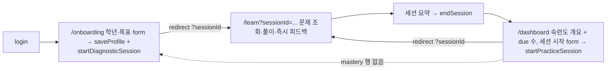

# PR3 — 학습 세션 + 적응형 엔진 (Learning Loop) · v2

## Context
PR1(기반)·PR2(콘텐츠 검수 파이프라인, merged `20626ba`)이 끝났고, 학생에게 노출 가능한 `reviewed=true` 문제 **41개(15개 개념 전부 ≥2문항)**가 `supabase/seed_problems.sql`로 재현된다. 그러나 아직 **학습 루프 자체가 비어 있다**: 대시보드는 concept count만 보여주는 빈 상태이고, `lib/adaptive`·`lib/scheduler`는 타입 골격만 있으며 채점 로직은 존재하지 않는다.

PR3의 목적은 PLAN.md §10이 못박은 PR3 범위 — "풀이 UI, attempts, lib/adaptive, lib/scheduler, 온보딩 진단 / 검증: 정오답에 따라 mastery와 next_review_at 변화" — 를 연결해 **"어제보다 나아졌다"** 루프의 토대를 만드는 것이다: 온보딩 미니 진단으로 초기 숙련도를 시드하고, 학습 세션에서 문제를 풀면 서버에서 채점되어 `attempts`에 기록되고, `concept_mastery`(EWMA)와 `next_review_at`(SM-2-lite)이 갱신된다.

알고리즘 상수/공식은 이미 `lib/adaptive/index.ts`·`lib/scheduler/index.ts`의 `ADAPTIVE_DEFAULTS`/`SCHEDULER_DEFAULTS`와 PLAN.md §5.1/§5.2에 정의되어 있다. PR3는 그 골격을 **구현**하고, 채점 모듈 + 서버액션 + UI + 단위테스트를 더한다.

## 사용자 확정 결정
- **테스트: Vitest** (devDep + `"test": "vitest run"`). 순수 함수 중심.
- **DB: migration `0005`만** — `attempts.submitted_answer text`(nullable) 추가. 그 외 스키마는 충분.
- **expression 채점: 제한적 항/인수 순서 정규화** (범위 제한):
  - 지원: 공백/특수공백 제거 · top-level 덧셈/뺄셈 항 순서 정규화 · top-level 곱 인수 순서 정규화 · 괄호 안 단순 다항식 항 정규화.
  - **미지원**: 전개식↔인수분해식 동치(`(x+3)(x+4)` vs `x^2+7x+12`), 분배/결합/자동 인수분해, CAS 수준 동치, `(x+3)^2` vs `(x+3)(x+3)`.
  - 파싱 실패 시 **whitespace-only canonical compare로 안전 fallback**.
  - **O/X 정규화는 short_answer 채점 내부에서 처리**(별도 answer_type 아님).
  - README line 130을 "제한적 항/인수 순서 정규화"로 정정(완전 동치 약속 금지).
- **세션 생성은 명시적 Server Action에서만** — Server Component 렌더 중 생성 금지(아래 v2 핵심 변경).

## v2 핵심 변경 (이번 개정)
1. **세션 생성 side effect 제거**: `/learn` Server Component 렌더에서 `startSession`을 호출하지 않는다(렌더 재실행 → `learning_sessions` 중복 생성 위험). 명시적 버튼/form action → Server Action이 세션 생성 → `redirect('/learn?sessionId=...')` → `/learn`은 sessionId로 조회만. **새로고침 시 같은 sessionId 재사용, 새 세션 생성 금지.**
2. **answer/solution 노출 리스크 표현 정정**: PR3의 보호는 **앱 세션 payload 기준**(제출 전 answer/solution 미반환). **DB 레벨 컬럼 보호는 PR3에서 하지 않으며 후속 PR 과제**로 명시.
3. **구현 단계 11단계로 엄격 분리**(아래 빌드 순서).
4. **채점 정책 유지**(위 확정 결정).
5. **`attempts.submitted_answer`**: migration 0005로 추가. submitAttempt는 **원 제출값(raw)**과 **normalizedSubmitted**를 구분 — DB에는 **원 제출값**을 저장, normalizedSubmitted는 응답/피드백 용도(저장 안 함).

## 착수 전 필수 (환경)
- `node_modules`가 **비어 있다** → `npm install` 먼저. 그 후 AGENTS.md 지시대로 `node_modules/next/dist/docs/`의 Next 16 문서를 확인하고(proxy/Server Actions/async cookies·redirect 시그니처) 기존 코드 패턴을 따른다.
- 로컬 Supabase: `npm run db:start` → `npm run db:reset`. (gotcha: reset 후 auth 502면 `docker restart supabase_auth_nexuslearning supabase_kong_nexuslearning` — project_id=`nexuslearning`.)

## Scope
**In**: 온보딩 미니 진단(5~7), 학습 세션 UI·풀이 흐름, attempts 기록(submitted_answer=원 제출값), `lib/grading`(신규), `lib/adaptive`·`lib/scheduler` 구현, `lib/session/select`(순수 선정 로직), 정오답→`concept_mastery`·`next_review_at` 갱신(서버측 채점), reviewed=true만 사용, Vitest 단위테스트, README 갱신.

**Out (유지)**: React Flow 지식맵·frontier 추천(lib/graph는 PR4), 성장 페이오프 애니메이션·스트릭·오늘의 퀘스트 고도화(PR5), 결제/캐릭터/소셜, Anthropic 실시간 생성, expression 전개↔인수분해 동치, **DB 레벨 answer/solution 컬럼 보호 리팩터**(후속 PR).

## 데이터 흐름 (v2: 세션 생성은 action에서만)

```mermaid
flowchart TD
  subgraph client["client (answer/solution 미수신)"]
    DASH["dashboard / onboarding\n'세션 시작' form"]
    LS["LearnSession (/learn?sessionId=...)"]
  end
  subgraph server["'use server' actions"]
    SPS["startPracticeSession / startDiagnosticSession"]
    SA["submitAttempt({sessionId,problemId,submitted,timeMs})"]
    ES["endSession(sessionId)"]
  end
  subgraph pure["pure TS (Vitest 대상)"]
    SEL["lib/session.selectSessionProblems"]
    G["lib/grading.gradeAnswer"]
    A["lib/adaptive.updateMastery"]
    SC["lib/scheduler.updateSchedule"]
  end
  subgraph db["Supabase (RLS self-access)"]
    P[("problems reviewed=true")]
    AT[("attempts")]
    CM[("concept_mastery")]
    SES[("learning_sessions summary={mode,problemIds}")]
  end

  DASH -->|button| SPS --> SEL
  SPS -->|insert summary={mode,problemIds}| SES
  SPS -->|redirect ?sessionId| LS
  LS -->|session 조회 problemIds + 기존 attempts resume| SES
  LS -->|problems 조회 answer/solution 제외| P
  LS -->|제출| SA
  SA -->|answer 서버측 조회 reviewed=true| P
  SA --> G
  SA --> A
  SA --> SC
  SA -->|insert submitted_answer=raw| AT
  SA -->|upsert on conflict user_id,concept_id| CM
  SA -->|correct,solution,wrongFeedback,mastery,nextReviewAt,normalizedSubmitted| LS
  LS -->|종료| ES -->|attempts 재집계 summary merge ended_at=now| SES
```

## DB 변경 — migration 0005만
기존 스키마는 충분: `concept_mastery(mastery, ease, interval_days, attempts_count, next_review_at, last_reviewed_at, PK(user_id,concept_id))`, `attempts(session_id,user_id,problem_id,concept_id,correct,time_ms,mode,created_at)`, `learning_sessions(started_at,ended_at,summary jsonb)`, self-access RLS(`attempts_insert/select_own`, `concept_mastery_*_own`, `learning_sessions_*_own`) 모두 존재(0002).
- **`supabase/migrations/0005_attempts_submitted_answer.sql`**: `alter table public.attempts add column if not exists submitted_answer text;` — **원 제출값** 저장용(nullable).
- `learning_sessions.status` 추가 안 함 → 활성 여부는 `ended_at IS NULL`로 추론.
- **선정된 문제 집합은 `learning_sessions.summary` jsonb에 생성 시 `{ mode, problemIds }`로 저장**(신규 테이블/마이그레이션 불요). 새로고침 시 재선정 없이 동일 문제 재사용을 보장하고, `endSession`이 여기에 집계를 merge. RLS 변경 없음.

## 순수 모듈 (no Supabase/Next import, Vitest 대상)

### `lib/grading/index.ts` (신규)
`gradeAnswer({ answerType, submitted, answer, choices? }) → { correct: boolean, normalizedSubmitted: string }`
- `stripSpace(s)`: 일반/전각(`　`)/NBSP/zero-width 공백 제거.
- **multiple_choice**: `stripSpace` 후 `answer`와 비교(필요 시 `choices` 매칭으로 보강). UI는 선택지 텍스트를 value로 제출.
- **short_answer**: trim + 내부 공백 정리 후 비교. **canonical `answer`가 O/X 토큰이면 O/X 정규화 경로**(factor-theorem-01/02 = short_answer + "O").
  - **O/X 정규화(short_answer 내부)**: `O,o,ㅇ,예,yes,true,1,참 → O` / `X,x,아니오,아니요,no,false,0,거짓 → X`.
- **expression** (제한적 정규화, 실패 시 whitespace-only fallback):
  1. `stripSpace`, 명시적 곱셈기호(`*`,`·`)는 인수 구분자로 처리.
  2. **top-level 곱**(괄호 그룹 `(...)`(+선택적 `^n`) 또는 그 사이 단항식 런의 나열)이면 → 각 인수를 재귀 정규화 후 **canonical 문자열로 정렬해 연결**. `^n`은 해당 그룹에 **부착 유지**(→ `(x+3)^2`는 분해/재배열 안 됨).
  3. **top-level 합**(괄호 깊이를 존중하며 `+`/`-`로 분리)이면 → 각 항에 명시적 부호 부여 후 **정렬해 연결**(입력 순서 무관 결정적 형태).
  4. 괄호 내부 단순 다항식에도 동일 항 정규화 적용.
  5. 괄호 불균형/예상 외 토큰 → **try/catch로 fallback**(공백만 제거한 비교).
- 결과적 동작(seed 기준): `3x^2-2x+3` == `-2x+3+3x^2` ✓ / `(x+4)(x+3)` == `(x+3)(x+4)` ✓ / `(x+3)^2` ≠ `(x+3)(x+3)` ✓ / `(x+3)(x+4)` ≠ `x^2+7x+12` ✓ (전개↔인수분해 미동치).

### `lib/adaptive/index.ts` (골격 → 구현)
타입/`ADAPTIVE_DEFAULTS` 유지, 함수 추가:
- `updateMastery({current, correct, difficulty, now})`: `weight=ADAPTIVE_DEFAULTS.weights[difficulty]; mastery=clamp(current.mastery + alpha*weight*((correct?1:0)-current.mastery),0,1)` → `{ mastery, attemptsCount: current.attemptsCount+1, lastReviewedAt:(now??new Date()).toISOString() }`. (alpha 0.3, weights 0.8/1.0/1.3)
- `effectiveMastery(state, now)`: `lastReviewedAt` null이면 `mastery`; 아니면 `mastery * exp(-lambda * max(0, daysSince(lastReviewedAt)))`. (lambda 0.035)

### `lib/scheduler/index.ts` (골격 → 구현)
타입/`SCHEDULER_DEFAULTS` 유지:
- `updateSchedule({current, correct, now})`:
  - 정답: ladder `[1,3,7,16]`에서 `idx=indexOf(current.intervalDays)`; `idx===-1`(0/off-ladder/첫 정답)→`1`, 아니면 `ladder[min(idx+1, last)]`(최대 16 cap). ease 유지.
  - 오답: `intervalDays=1`, `ease=max(minEase 1.3, current.ease-0.2)`.
  - 공통: `nextReviewAt=addDays(now, intervalDays).toISOString()`, `lastReviewedAt=now`.
- `dueConcepts(states, now)`: `nextReviewAt!=null && new Date(nextReviewAt) <= now`인 `conceptId[]`.

### `lib/session/select.ts` (신규, 순수)
`selectSessionProblems({ concepts, masteryByConcept, reviewedProblems, mode, now, limit }) → problems[]` (DB import 없음; 서버액션이 데이터를 조회해 전달).
- **practice**: due 개념 우선(`dueConcepts`) → `effectiveMastery` asc(신규=0 우선) → `order_index` asc. 개념당 1~2문항, 총 limit 5~10. 가능하면 세션 내 중복 회피.
- **diagnostic**: `order_index` 앞쪽 5~7개 개념에서 개념당 1문항(쉬운 난이도 우선). mastery 없음 전제.
- 반환은 **선정된 problemId 순서 목록**이 핵심(서버액션이 `summary.problemIds`로 저장).

## 서버 액션 / API (`'use server'`, 기존 `app/admin/review/actions.ts` 패턴)

### `app/learn/actions.ts`
- `startPracticeSession()` (form action): getUser → 개념·기존 mastery·reviewed 문제 조회 → `selectSessionProblems({mode:'practice'})` → `learning_sessions` insert(`user_id`, `summary={ mode:'practice', problemIds }`) returning id → **`redirect('/learn?sessionId='+id)`**. (Server Component이 아니라 명시적 action에서만 생성.)
- `submitAttempt({sessionId, problemId, submittedAnswer, timeMs})`: getUser → 세션 소유 확인 → `problems`에서 `.eq('reviewed', true)`로 `answer, answer_type, choices, concept_id, difficulty, solution, wrong_feedback` 서버측 조회 → `gradeAnswer` → `attempts` insert(`mode`는 세션 summary의 mode, **`submitted_answer = submittedAnswer(원 제출값)`**) → 기존 `concept_mastery` 읽어(없으면 기본값 `mastery:0,attemptsCount:0,intervalDays:0,ease:2.5,…null`) `updateMastery`+`updateSchedule` 계산 → `concept_mastery` upsert(`onConflict:'user_id,concept_id'`) → `{ correct, solution, wrongFeedback, masteryBefore, masteryAfter, nextReviewAt, normalizedSubmitted }` 반환. **solution/wrong_feedback는 제출 이후에만 반환. normalizedSubmitted는 응답 전용(DB 미저장).**
- `endSession(sessionId)`: getUser → 세션 소유 확인 → 해당 세션 `attempts`에서 `problemCount`/`correctCount` **서버 재계산**(클라이언트 신뢰 X) → `learning_sessions` update(`ended_at=now`, `summary`에 `{ problemCount, correctCount, durationMs }` merge — 기존 `{mode,problemIds}` 유지). conceptDelta 표시는 클라이언트가 submitAttempt 응답을 누적해 요약 화면에 렌더(display-only).

### `app/onboarding/actions.ts`
- `saveProfile(grade, goal)` (form action): getUser → `profiles` update(`grade,goal`) `.eq('id', user.id)`(0003 트리거가 행 자동 생성하므로 update).
- `startDiagnosticSession()` (form action): `selectSessionProblems({mode:'diagnostic'})` → `learning_sessions` insert(`summary={ mode:'diagnostic', problemIds }`) → **`redirect('/learn?sessionId='+id)`**. (진단 풀이/채점은 /learn + submitAttempt 공용 경로로 처리 → 초기 `concept_mastery` 시드.)

## 화면 / 흐름 (v2)



- **온보딩** `app/onboarding/page.tsx`(server guard) + client form: 학년·목표 입력 → 제출 시 `saveProfile` 후 `startDiagnosticSession`(form action)이 세션 생성 + `redirect('/learn?sessionId=...')`.
- **학습 세션** `app/learn/page.tsx`(server guard): **렌더 중 세션 생성 안 함.** `searchParams.sessionId`를 받아 ① 세션 소유·존재 확인(RLS), ② `summary.problemIds`로 reviewed 문제 조회(**answer/solution 제외**), ③ 해당 세션의 기존 `attempts` 조회로 이미 푼 문제 파악(새로고침 resume) → client `LearnSession`에 `{ sessionId, mode, problems, answeredProblemIds }` 전달. 세션에 `ended_at`이 있으면 요약/대시보드로.
  - client `LearnSession`: 미응답 문제부터 1개씩, answer_type별 입력(MC=radio from choices, short/expression=text) → 제출 시 `submitAttempt` → 즉시 피드백(정오답·solution·wrong_feedback·mastery before→after·nextReviewAt) → 다음 → 마지막 후 `endSession` → 요약.
- **세션 요약**: 푼 문제수, 정답수, 개념별 mastery before→after, 다음 복습일. → 대시보드 CTA.
- **대시보드 와이어링** `app/dashboard/page.tsx`: `concept_mastery` 행 조회. 0행이면 `/onboarding` 유도(soft redirect/CTA). 있으면 개념 숙련도 개요 + due 수(`next_review_at<=now`) + **"세션 시작" form(`action={startPracticeSession}`)**. (애니메이션·스트릭은 PR5.)
- **`proxy.ts`**: `requiresAuth`에 `pathname.startsWith('/learn')`·`startsWith('/onboarding')` 추가(현 line 40~41). 라우트 추가 단계(7~8)에서 함께 반영.

## Vitest 셋업
- devDep `vitest` 추가, `package.json` scripts에 `"test": "vitest run"`.
- 최소 `vitest.config.ts`(`test.environment:'node'`). 순수 모듈/테스트는 상대 경로 import → `@/` alias 불요(서버액션은 단위테스트 대상 아님).
- 테스트 파일: `lib/grading/grading.test.ts`, `lib/adaptive/adaptive.test.ts`, `lib/scheduler/scheduler.test.ts`, `lib/session/select.test.ts`.

## 빌드 순서 (11단계, 엄격 분리)
1. **기반**: `npm install` → Next 16 docs 확인 → **migration 0005** + **Vitest 셋업**(devDep/script/config) → `db:reset` + vitest 스모크 통과.
2. **lib/grading** 구현 + 테스트: MC / short / O·X / expression — **항 순서 변경 정답 / 인수 순서 변경 정답 / 공백 차이 정답 / 전개식↔인수분해식 오답 / `(x+3)^2`≠`(x+3)(x+3)` / fallback**.
3. **lib/adaptive** 구현 + 테스트(단조성·clamp·decay).
4. **lib/scheduler** 구현 + 테스트(ladder 1→3→7→16·cap·오답 reset+ease penalty·dueConcepts).
5. **lib/session/select** 구현 + 테스트(due 우선·effectiveMastery 정렬·개념당 한도·diagnostic 선정).
6. **Server Actions**: `startPracticeSession`/`startDiagnosticSession`(redirect 포함)·`submitAttempt`(원 제출값 저장 + 엔진 연결)·`endSession`(재집계 merge)·`saveProfile` — DB 쓰기·엔진 연결.
7. **`/onboarding` UI** + `proxy.ts` 가드 추가(`/onboarding`).
8. **`/learn` UI**(searchParams.sessionId 조회·resume·즉시 피드백, 렌더 중 세션 생성 없음) + `proxy.ts` 가드 추가(`/learn`).
9. **dashboard 연결**(숙련도 개요 + due 수 + 세션 시작 form + mastery-없음 게이팅).
10. **README 갱신**(학습 루프·채점 정책·expression 한계 line 130 정정·answer/solution 보호 범위 명시·scripts/구조 갱신).
11. **검증**: `db:reset`, RLS, `npm run lint`, `npm run build`, `npm run test`, 브라우저.

## 검증
- **Unit (Vitest, DoD 필수)**: grading/adaptive/scheduler/select — 위 케이스 전부 통과. 런타임 비의존.
- **DB/RLS**: `db:start`→`db:reset`(0005 포함) → 사용자 생성 → `attempts` insert(`submitted_answer`=원 제출값 포함)·`concept_mastery` upsert가 self RLS로 동작, 타 사용자 행 비노출, 문제는 reviewed=true만 조회됨 확인.
- **세션 생성 무중복(v2)**: `/learn?sessionId=...` 새로고침 시 `learning_sessions` 신규 행이 생기지 않고 동일 세션 resume, 이미 푼 문제 재출제 안 됨 확인.
- **브라우저/라이브앱**: 온보딩이 초기 mastery 생성, 세션 제출이 attempts 기록 + **정답/오답에서 mastery·next_review_at가 서로 다르게 변화**, 요약 표시. (Playwright MCP 미설치 → HTTP 가드 + REST + 수동 확인 병행.)
- **회귀**: `npm run lint`, `npm run build`, `npm run test`.

## Definition of Done
- 온보딩 미니 진단이 사용자 초기 `concept_mastery`를 시드.
- 세션: 제출 → `attempts`(submitted_answer=원 제출값) 기록 → `mastery`(EWMA)·`next_review_at`(SM-2-lite) 갱신, **정답/오답이 서로 다른 변화** 산출(검증 가능).
- 세션 생성은 명시적 Server Action에서만 발생, **`/learn` 새로고침이 새 세션을 만들지 않고 resume**.
- reviewed=true 문제만 제공. **앱 세션 payload 기준으로 answer/solution은 제출 전 미반환**(아래 보안 주석 참조).
- 채점 모듈(MC/short/O·X/expression-제한정규화) + adaptive + scheduler + select가 Vitest 통과; 전개↔인수분해 미동치 문서화.
- migration 0005 적용·기존 attempts RLS 정상.
- lint/build/test 통과; README에 학습 루프·채점 정책·expression 한계(line 130 정정)·answer/solution 보호 범위 기술.

## Risks / notes
- **보안 — answer/solution 노출(중요, 표현 정정)**: 기존 `problems_read_reviewed`(0002) RLS는 reviewed 문제의 `answer/solution` **컬럼까지 노출**한다. PR3는 **앱 세션 payload 기준으로만** 보호한다 — `startPracticeSession`/`/learn`가 반환하는 문제에서 `answer/solution/wrong_feedback`를 제외하고, 채점은 서버측에서 수행. **그러나 DB 레벨 컬럼 보호는 PR3에서 하지 않는다**(직접 REST/클라이언트로 reviewed 문제를 조회하면 answer를 볼 수 있음). **DB-level hardening은 후속 PR 과제**로 명시:
  - public 노출용 problem view 분리(answer/solution 제외 컬럼만)
  - answer/solution 접근은 서버 전용 경로로 한정
  - service-role 또는 SECURITY DEFINER 기반 채점 재설계 검토
  - → PR3에서 이 보안 리팩터는 **범위 외**(범위 비대화 방지).
- **Next 16 특이성**: 구현 전 `node_modules/next/dist/docs` 확인(AGENTS.md). async cookies·Server Actions·`redirect`·proxy 네이밍은 기존 코드 패턴 준수.
- expression 완전 동치(전개↔인수분해, CAS) 판정은 후속 PR의 명시적 과제.
- 제약: 승인 전까지 코드 commit/push/PR 없음. 착수 시 `main` 최신화 후 `pr3-learning-loop` 브랜치 생성.
