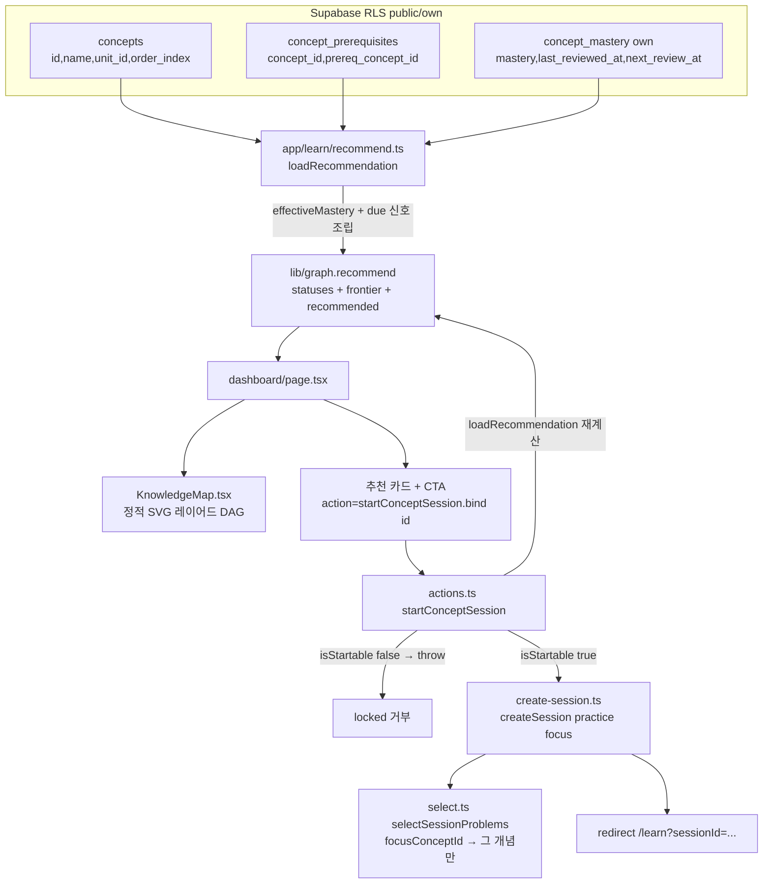

# PR4 — 지식맵 + 프런티어 추천

## Context
PR3까지 학습 루프(진단·세션·서버 채점·EWMA 숙련도·SM-2-lite 복습)가 동작한다. 하지만 사용자는
"지금 무엇을 배워야 하는지"를 알 수 없고, 대시보드는 개념별 숙련도 리스트만 보여준다. PLAN.md §5.3/§8의
**선수관계 DAG 기반 프런티어 추천**과 **지식맵**이 빠져 있어 "다음 한 걸음"이 제시되지 않는다.

이 PR은 (1) `lib/graph`의 타입 골격을 실제 frontier/recommend 로직으로 채우고, (2) 대시보드에
경량 지식맵 + "다음 학습 개념" 추천 카드를 임베드하며, (3) 추천 개념의 학습 세션을 시작하는 전용
Server Action을 추가한다. **DB 마이그레이션 0, 신규 의존성 0, React Flow 미사용.** 기존 순수함수
(`effectiveMastery`, `dueConcepts`, `selectSessionProblems`)와 서버 패턴(`create-session.ts`)을 재사용한다.

## 목표 (한 문장)
선수관계 DAG를 대시보드에 정적 SVG로 시각화하고 `effectiveMastery` 기반 frontier 추천으로 다음 개념을
제시해, 전용 `startConceptSession(conceptId)`로 그 개념의 학습 세션을 시작하게 한다.

## Scope
**할 것**
- `lib/graph/index.ts`: 골격을 실제 구현으로 교체 — `recommend`/`frontier`/`isStartable`/status 분류 + 정렬 + fallback.
- `lib/graph/graph.test.ts`: 신규 Vitest(상태분류·정렬 4기준·fallback·isStartable).
- `lib/session/select.ts`: `focusConceptId` 옵션(개념 한정 선정) + `select.test.ts` 케이스 추가.
- `app/learn/recommend.ts`(신규, server-only, **`'use server'` 아님**): Supabase 조회 → `RecommendInput` 조립 → `recommend` 호출 → 대시보드/액션 공용 결과 반환.
- `app/learn/create-session.ts`: `createSession(mode, opts?)`로 `focusConceptId`/`source` 지원.
- `app/learn/actions.ts`: `startConceptSession(conceptId)` 추가(서버 재검증 → locked 거부 → focus 세션 생성 → redirect).
- `app/dashboard/page.tsx` + `app/dashboard/KnowledgeMap.tsx`(신규): 정적 지식맵 + 추천 카드 + CTA.
- `README.md` 갱신. `npm run test`/`lint`/`build` 통과.

**안 할 것**
- React Flow/`@xyflow/react` 도입, 신규 `/map` 라우트, DB migration, 의존성 추가.
- 인터랙티브 그래프(팬·줌·드래그), 추천 top-N/경로 안내(top-1만).
- 성장 페이오프·노드 애니메이션·스트릭·퀘스트(PR5), 계측(PR6).
- DB-level answer/solution 컬럼 보호(별도 보안 PR — README 후속과제로 유지).
- `startPracticeSession` 기본 정렬을 frontier로 교체(현행 유지).

## 데이터 흐름



## lib/graph API (`lib/graph/index.ts`)
`ConceptNode`와 `GRAPH_DEFAULTS`(masteryThreshold 0.7)는 유지. 미사용 골격 `FrontierInput`/`Frontier`는
교체(레포 어디서도 import되지 않음 — grep로 확인됨).

```ts
export interface ConceptNode { id: string; unitId: string; prereqIds: string[]; orderIndex: number } // 유지
export type NodeStatus = 'locked' | 'available' | 'in_progress' | 'mastered'
export interface ConceptSignal { effectiveMastery: number; due: boolean }
export interface RecommendInput {
  concepts: ConceptNode[]
  signalByConcept: Record<string, ConceptSignal> // 누락 개념 ⇒ {effectiveMastery:0, due:false}
  threshold?: number // default GRAPH_DEFAULTS.masteryThreshold
}
export interface Recommendation {
  statuses: Record<string, NodeStatus>
  frontier: string[] // 학습 시작 가능한 frontier 후보(available + in_progress), 정렬됨
  recommended: {
    conceptId: string
    source: 'frontier' | 'fallback'
    reason?: 'review_due' | 'weakest_mastered' // fallback일 때만 설정
  } | null
}
export function frontier(input: RecommendInput): string[]
export function recommend(input: RecommendInput): Recommendation
export function isStartable(rec: Recommendation, conceptId: string): boolean
```

## 알고리즘 (확정)
임계값 `T = threshold ?? GRAPH_DEFAULTS.masteryThreshold`. 신호 조회 헬퍼: `sig(id) = signalByConcept[id] ?? {effectiveMastery:0, due:false}`.

- **prereqMet(id)**: 모든 prereq가 `eff(prereq) >= T`(prereq 공집합인 root는 자동 충족). 누락 prereq id는 signal 기본값(eff 0)이라 미충족 처리.
- **status (전체 분할)**:
  - `locked` = `!prereqMet`
  - `available` = `prereqMet && eff === 0` (선수 충족·미학습)
  - `in_progress` = `prereqMet && 0 < eff < T` (선수 충족·학습중, decay로 떨어진 개념 포함)
  - `mastered` = `eff >= T`
  - (참고: `eff === 0 ⟺ mastery === 0`이므로 "available && mastery<T"의 raw-mastery 조건은 자동 충족 — signal에 raw mastery 불필요.)
- **frontier**: `available ∪ in_progress`(= `prereqMet && eff < T`, startable 후보). 정렬 — ① 평균 prereq eff 내림차순(root는 1.0) ② 자기 eff 오름차순 ③ due(true 우선) ④ orderIndex 오름차순. tie-break 결정적.
- **recommended (top-1 유지)**:
  - frontier 비어있지 않으면 `{ frontier[0], 'frontier' }`.
  - frontier가 비면 fallback: pool = non-locked 개념(이 경우 mastered만 존재). due ∩ pool 있으면 그중 `eff` 최저 → `reason:'review_due'`; 없으면 pool 중 `eff` 최저 → `reason:'weakest_mastered'`. `{ id, 'fallback', reason }`.
  - `null`은 **concepts가 비었거나, frontier·pool 모두 비는 비정상(예: cycle로 전부 locked)** 일 때만. fallback 대상은 항상 non-locked이라 startable이거나 null.
- **불변식(완화된 계약)**: 정상 seed DAG에서는 root가 미mastered면 항상 available이므로 **frontier가 비면 모든 개념이 mastered 상태로 취급**된다. 다만 이를 강한 보장으로 두지 않고, 누락 prereq/cycle 등 비정상 데이터에서는 `recommended:null`을 허용한다.
- **방어**: depth/status 계산은 cycle에서 무한루프 없이 종료(visited 가드). 누락 prereq id·cycle 입력에 대한 테스트 유지.
- **isStartable(rec, id)** = `rec.statuses[id] !== 'locked' && (rec.frontier.includes(id) || rec.recommended?.conceptId === id)`.

## 서버 헬퍼 (`app/learn/recommend.ts`, 신규)
`create-session.ts`와 동일하게 server-only(상단 `'use server'` 없음). 대시보드 페이지와 `startConceptSession`가 공용으로 호출.

```ts
export interface DashboardRecommendation {
  hasProgress: boolean
  avgEffectiveMastery: number        // concept_mastery 행이 있는 개념들의 eff 평균 (현행 의미 보존)
  dueCount: number                   // next_review_at != null && <= now 인 행 수 (현행 의미 보존)
  concepts: { id: string; name: string; unitId: string; orderIndex: number; prereqIds: string[] }[]
  rec: Recommendation                // statuses/frontier/recommended (isStartable 재사용용)
  nameById: Record<string, string>
}
export async function loadRecommendation(): Promise<DashboardRecommendation>
```
구현: `requireUser` 후 `Promise.all`로 `concepts(id,name,unit_id,order_index)`,
`concept_prerequisites(concept_id,prereq_concept_id)`, `concept_mastery(concept_id,mastery,last_reviewed_at,next_review_at)` 조회.
- 개념별 `prereqIds`는 prerequisites를 `concept_id`로 그룹핑.
- `signalByConcept`: 각 mastery 행에 대해 `effectiveMastery({mastery, attemptsCount:0, lastReviewedAt:last_reviewed_at}, now)`(=`@/lib/adaptive` 재사용, 대시보드/select와 동일 호출형) + `due = next_review_at != null && new Date(next_review_at) <= now`.
- `ConceptNode[]` 조립 후 `recommend(...)` 1회 호출(서버에서 `now` 한 번 고정).
- `hasProgress = masteryRows.length > 0`, `avgEffectiveMastery`/`dueCount`는 현 dashboard 로직과 동일 계산.

## select focus 옵션 (`lib/session/select.ts`)
`SelectInput`에 `focusConceptId?: string` 추가. practice 경로 진입 전 early-branch:
```ts
if (input.focusConceptId) {
  const arr = byConcept.get(input.focusConceptId) ?? [] // 이미 easy-first 정렬됨
  return arr.slice(0, limit).map((p) => p.id)
}
```
round-robin/`MAX_PER_CONCEPT`(=2)를 우회해 단일 개념에서 최대 `limit`문항을 쉬움 우선으로 제공.
focus 미지정 시 기존 동작 완전 불변. `now`/`mode` 미사용 가능(focus는 practice 전용으로 액션에서만 호출).

## startConceptSession (`app/learn/actions.ts`, `create-session.ts`)
`create-session.ts` — `createSession(mode, opts?)`:
```ts
export async function createSession(
  mode: SessionMode,
  opts?: { focusConceptId?: string; source?: 'frontier' | 'fallback' },
): Promise<string>
```
- `selectSessionProblems({ ..., focusConceptId: opts?.focusConceptId })` 전달.
- **0-문제 가드**: focus 경로에서 `problemIds.length === 0`이면 빈 세션을 만들지 않고 `throw new Error('no reviewed problems for concept')`. (시드엔 개념별 2+ 존재하나 PR4에 방어 포함.)
- `summary`: 기존 `{ mode, problemIds }`에 focus 시 `{ ...,focusConceptId, source }` 병합(jsonb, migration 없음).

`actions.ts` — `startConceptSession(conceptId: string)` (`'use server'` 파일 내, 폼 바인딩 시 trailing FormData는 무시됨):
```ts
export async function startConceptSession(conceptId: string) {
  const { rec } = await loadRecommendation()
  if (!isStartable(rec, conceptId)) throw new Error('concept not startable')
  const source = rec.frontier.includes(conceptId) ? 'frontier' : 'fallback'
  const id = await createSession('practice', { focusConceptId: conceptId, source })
  redirect(`/learn?sessionId=${id}`)
}
```
클라이언트가 임의 conceptId를 보내도 **서버가 동일 입력으로 recommend 재계산** 후 locked/비추천을 거부.

## UI (`app/dashboard/page.tsx` + `app/dashboard/KnowledgeMap.tsx`)
`page.tsx`: 인라인 concepts/mastery 조회·avg·dueCount 계산을 제거하고 `loadRecommendation()` 1회 호출로 대체.
- `hasProgress=false` → 기존 온보딩 CTA 유지(맵 미표시).
- 진행 있음 → 상단 평균/복습 카드(현행) + **추천 카드** + **지식맵** + 개념 리스트(현행, 단 status 색 점 추가는 선택).
- **평균 숙련도 라벨 명확화**: 계산 의미는 현행 유지(= `concept_mastery` 행이 있는 **학습한 개념** 평균, 전체 15개 평균 아님). UI 라벨을 "평균 숙련도 (학습한 개념)"로, README에 "지식맵은 전체 개념 상태를 보여주므로 평균 카드와 분모가 다르다"고 명시. 전체-개념 평균으로의 전환은 PR4 범위 밖(보류).
- 추천 카드: `rec.recommended` 기준. **추천 카드 CTA가 PR4의 유일한 학습 진입점**(맵은 상태 이해용).
  - `'frontier'` → "다음 학습 개념: {nameById[id]}" + 배지 `프런티어`, CTA 문구 **"이 개념 학습"**.
  - `'fallback'` → 보조 문구 "전체 기반이 탄탄해요" + (reason 따라) 복습 대상 {name}, 배지 `복습`, primary CTA 문구 **"복습 시작"**.
  - CTA `<form action={startConceptSession.bind(null, id)}>` 버튼(기존 `startPracticeSession` form 패턴과 동일).
- `startPracticeSession` 일반 세션 버튼은 보조로 유지.

`KnowledgeMap.tsx`(신규, 서버 컴포넌트 — **정적·상호작용 없음. 맵은 상태 이해용, 추천 카드가 행동 진입점**). props `{ concepts, statuses, recommendedId }`. 노드별 form/onClick/`'use client'` 없음.
- **레이아웃**: `depth(c) = prereq 없으면 0, 아니면 1 + max(depth(prereq))`(메모이즈 + visited 가드로 cycle 안전). depth → 열(x), 같은 depth 내 `orderIndex` 정렬 → 행(y).
- **렌더**: 단일 `<svg>` viewBox. 각 prereq→concept를 `<line>`, 각 노드를 `<g>`(rect + 개념명 `<text>`). 한국어 텍스트 OK.
- **상태색(4단계)**: locked=회색 흐림, available=윤곽선만, in_progress=부분 채움, mastered=채움(점등). `recommendedId`는 테두리 하이라이트.
- 15노드/17엣지가 겹침 없이 읽히도록 colWidth/rowHeight 여유 확보(수동 검증 항목).

## 작업 순서 (각 ≤5파일)
1. **lib/graph 구현** — `lib/graph/index.ts` 교체(위 API). AC: 타입 컴파일·순수. Verify: `npm run build`(타입).
2. **lib/graph 테스트** — `lib/graph/graph.test.ts`. 케이스: root available(eff 0), prereq 충족·0<eff<T→in_progress·미충족→locked, 자기>=T→mastered, frontier=available∪in_progress 정렬 4기준 격리, fallback(전부 mastered: due면 reason'review_due', due 없으면 'weakest_mastered'), isStartable(locked 거부·frontier 허용·fallback(mastered) 허용), **방어: 누락 prereq id→locked, cycle 입력→무한루프 없이 종료·전부 locked면 recommended:null, concepts 빈 입력→null**. Verify: `npm run test`.
3. **select focus** — `lib/session/select.ts` + `select.test.ts`. AC: 기존 케이스 그대로 통과 + focus는 해당 개념만 쉬움 우선 ≤limit + **focus 개념 문제 0개면 `[]` 반환**. Verify: `npm run test`.
4. **서버 헬퍼** — `app/learn/recommend.ts`(신규). AC: 대시보드/액션 공용. Verify: `npm run build`.
5. **세션 진입** — `app/learn/create-session.ts`(opts 확장 + 0-문제 가드) + `app/learn/actions.ts`(`startConceptSession`). AC: locked 거부·0-문제 거부·정상 생성·summary.focus 기록. Verify: build + 수동.
6. **대시보드 UI** — `app/dashboard/page.tsx` 수정 + `app/dashboard/KnowledgeMap.tsx`(신규). AC: 맵·추천·CTA 렌더 및 동작. Verify: build + 브라우저 수동.
7. **README** — 지식맵(4-status)/frontier/`startConceptSession`/effective 기준/평균=학습한 개념(맵과 분모 상이)/React Flow 비채택/보안 분리. (프로젝트 구조 트리의 `graph/index.ts` 설명 갱신.)
8. **검증 패스** — `npm run test && npm run lint && npm run build` + DB/RLS·브라우저 수동(아래).

## 테스트/검증
- **Vitest**: `lib/graph`(상태 4분할·정렬·fallback·isStartable·방어:누락prereq/cycle/빈입력), `lib/session/select`(focus·focus 0문제→[]·기존 회귀). 순수·런타임 비의존(`vitest.config.ts` include `lib/**/*.test.ts` 자동 포함).
- **DB/RLS smoke**: `concept_prerequisites` public read 1회(anon REST), `concept_mastery` self-only. locked 거부는 `isStartable` 단위테스트로 입증.
- **브라우저 수동**: psql로 특정 사용자의 어떤 개념 선수들을 `mastery>=0.7`로 주입 → `/dashboard`에서 그 다음 개념이 available(맵 점등 전 단계)·추천 카드 노출 → "이 개념 학습" → `/learn?sessionId=...`이 focus 개념 문제를 출제하는지 확인. (Playwright MCP 미설치 → HTTP/psql 병행, PR3와 동일 한계.)
- **회귀**: 기존 select 테스트·dashboard 렌더·`startPracticeSession` 경로 불변 확인.

## 리스크 / 후속
- 맵 가독성(depth 레이어로 완화, 수동 확인) / focus 개념 reviewed 문제 0개 → 서버에서 거부(빈 세션 방지, PR4 포함).
- 동시성: `startConceptSession` 서버 재검증이 1차 방어(치명 아님).
- Deferred: React Flow 고도화, 노드 애니메이션·퀘스트(PR5), 계측(PR6), **DB-level answer/solution 보호(별도 보안 PR)**.
