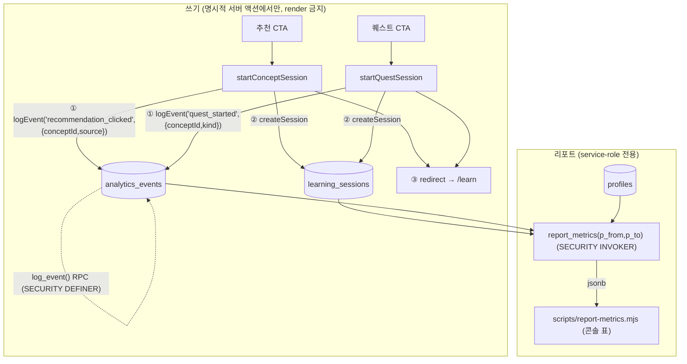

# PR6 — 계측 (루프 완주 + D1/D7) · v3.1 (approved)

> 별도 PR(`pr6-instrumentation`). main에 보안 하드닝 머지(`b9376eb`) 전제.
> 원격 Ultraplan 정제(v3.1) 승인본. 아래 **구현 보정 3가지**를 반영해 구현함.

## Context
PR1~PR5로 학습 루프(온보딩 진단 → 세션 → 채점 → 성장 페이오프 → 복습 예약)는 작동한다. 하지만 "루프가 실제로 **완주**되는가", "사용자가 **재방문**하는가(D1/D7)", "추천/퀘스트 CTA가 **세션으로 전환**되는가"를 측정할 계측이 전무했다(analytics 테이블·이벤트·SDK 없음). PLAN.md PR6(`루프 완주 이벤트, D1/D7 분석 쿼리, 내부 리포트`)과 §12 성공 지표(루프 완주율, D1≥40%, D7≥20%, 실측 숙련도 우상향)를 **측정 가능**하게 만든다.

## 핵심 원칙: 도출 우선, 이벤트는 최소
게이트 지표 대부분은 **기존 테이블에서 도출** 가능 — 새 이벤트는 도출 불가능한 "클릭 의도"만 기록한다.

| 지표 | 출처 | 방식 |
|---|---|---|
| signup 코호트 | `profiles.created_at` | 도출 |
| 루프 완주 | `learning_sessions.ended_at not null` + `summary->>'problemCount' > 0` | 도출 |
| 온보딩 | `learning_sessions.summary->>'mode' = 'diagnostic'` | 도출 |
| CTA 결과 세션 | `learning_sessions.summary->>'source' in ('frontier','fallback')` | 도출 |
| **CTA 클릭 의도** | — (세션 생성 실패/이탈 클릭은 흔적 없음) | **신규 이벤트** |

→ 신규 이벤트는 단 둘: `recommendation_clicked`, `quest_started`.

## 데이터 흐름

emit(①)은 `createSession`(②)·`redirect`(③) **이전**에 발행 → 세션 생성이 실패해도 클릭 의도는 분모에 남는다. `redirect()`는 `NEXT_REDIRECT`를 throw하므로 try/catch로 감싸지 않는다(`logEvent`만 내부 try/catch).

## 설계

### 1) migration `0007_analytics_events.sql`
- **테이블** `analytics_events(id bigint identity pk, user_id uuid null FK auth.users on delete set null, name text not null check in ('recommendation_clicked','quest_started'), props jsonb not null default '{}', created_at timestamptz default now())`. 인덱스 `(name,created_at)`·`(user_id,created_at)`. RLS enable + **정책 0개**(anon/authenticated read·direct write 불가; 쓰기=RPC, 읽기=service_role). PII 금지 주석.
- **`log_event(p_name, p_props)` SECURITY DEFINER**: `auth.uid()` null→raise(42501); name 화이트리스트; props `jsonb_typeof='object'` + `pg_column_size<=4096`; **이벤트별 props 화이트리스트**(허용 key 정확히·enum·slug `^[a-z0-9][a-z0-9-]{0,63}$`만, 그 외 거부): `recommendation_clicked={conceptId,source∈frontier/fallback}`, `quest_started={conceptId,kind∈new/review}`; `insert (auth.uid(), p_name, v)`. `revoke execute from public,anon` + `grant authenticated`. (DEFINER 정당: INSERT 정책 없어 invoker는 RLS로 막힘; user_id=invoker JWT claim이라 위조 불가.)
- **`report_metrics(p_from, p_to)` SECURITY INVOKER, stable, 동적SQL 없음**: 호출자=service_role(RLS 우회)이라 INVOKER로 충분·더 안전. `revoke execute from public,anon,authenticated` + `grant service_role`. window `[p_from,p_to)`(null→하한 없음/`now()`), 일 버킷 `at time zone 'Asia/Seoul'`. 반환 jsonb(집계만 — REST max_rows 회피):
  - `completion`: started/completed/rate + by_mode(diagnostic/practice). completed=`ended_at not null and (summary->>'problemCount')::int>0`.
  - `cta`: clicks/converted를 **동일 window** `[cta_lo,hi)`로(=`cta_lo=coalesce(p_from,min(events.created_at))`) → PR6 이전 source 세션 미혼입. window_from·clicks_by_name·converted_by_source·conversion_pct. (집계 비율; 퍼-클릭 상관은 후속.)
  - `funnel`(**signup cohort 기준**): signups=cohort, onboarded=cohort 중 diagnostic 세션 보유, completed_at_least_one=cohort 중 완주 세션 보유. 세션 활동 `< hi`로 제한 → historical 안정.
  - `retention`: 코호트별 D1/D7 **정확히 N일째**(KST), 분모=signup 코호트, 미성숙(`today < cohort_day+N`)은 null. `cohort_size`·`d1_mature`/`d7_mature` 병기.

### 2) emit — `lib/analytics/log-event.ts` (신규, 서버 전용)
`AnalyticsEventName = 'recommendation_clicked'|'quest_started'`; `logEvent(name, props)` = user client 생성 후 `try { await supabase.rpc('log_event', {p_name,p_props}) } catch {}`. **best-effort awaited telemetry**: await하되 실패를 삼켜 학습 액션을 깨지 않음.

### 3) emit 배선 — `app/learn/actions.ts`
- `startConceptSession`: isStartable·source 계산 후, **createSession 이전** `await logEvent('recommendation_clicked', {conceptId, source})`.
- `startQuestSession`: quest 멤버십·kind 계산 후, **createSession 이전** `await logEvent('quest_started', {conceptId, kind})`.
- `endSession` 변경 없음(재종료는 UI상 도달 불가; 완주는 per-row boolean 도출이라 멱등 가드 불요).
- render(RSC) emit 금지.

### 4) 리포트 — `scripts/report-metrics.mjs` (신규, service-role, `dump-reviewed.mjs` 패턴)
`SUPABASE_SERVICE_ROLE_KEY` 필수. 선택 `--from`/`--to`. `--from` 없으면 경고. `POST /rest/v1/rpc/report_metrics`→콘솔 표 4개(completion/cta/funnel/retention). retention 미성숙 셀 `—` + `d1_mature`/`d7_mature` 컬럼 표시. deps 0(전역 fetch). `package.json` `report:metrics` 추가.

### 5) `README.md`
PR6 섹션: analytics_events·log_event(props whitelist)·report_metrics·report:metrics 실행법·KST·완주/리텐션(정확히 N일째)·funnel=signup cohort·CTA window caveat·Privacy·best-effort awaited telemetry.

## Privacy / 저장 금지
`props`는 ID/enum/boolean/count만. 허용 키: `conceptId`(slug), `source`(frontier|fallback), `kind`(new|review). 금지: 원문 `submitted_answer`, 자유텍스트 `goal`/`grade`, email/이름, 문제 `stem`/`solution`/`answer`, IP/User-Agent.

## 구현 보정 (리뷰 반영, 3가지)
1. **PR6_PLAN.md 커밋 포함** — 본 문서(PR3~5 관례).
2. **retention mature 명시** — `report_metrics` 반환 + 스크립트 표에 `d1_mature`/`d7_mature` boolean 포함(분모 오해 방지; 날짜 코호트라 mature는 cohort_size or 0).
3. **best-effort awaited 표현** — `logEvent`는 `await`하되 내부 try/catch로 실패를 삼킴. README/주석에서 "fire-and-forget"이 아닌 **"best-effort awaited telemetry"**로 기술.

## Task breakdown
1. `0007_analytics_events.sql`(테이블+CHECK+인덱스+RLS0 + log_event DEFINER + report_metrics INVOKER + grants + PII 주석).
2. `lib/analytics/log-event.ts`.
3. `app/learn/actions.ts` emit 2줄.
4. `scripts/report-metrics.mjs` + `package.json`.
5. `README.md` PR6 섹션 + `PR6_PLAN.md`.
6. 검증 패스.

## Verification
- 스키마: db:reset로 0007 적용; psql 테이블/인덱스/CHECK; RLS anon·authenticated read 거부/0, service_role OK; log_event=DEFINER·report_metrics=INVOKER; execute grants(log_event=authenticated/service_role, report_metrics=service_role만).
- `log_event` 스모크: anon 거부; authenticated 정상 props→행1·user_id=호출자; 거부 케이스(잘못된 name·과대 props·object 아님·금지 key·enum 외 source/kind·slug 아님 conceptId·추가 key).
- `report_metrics`: anon/authenticated REST 거부, service_role 200+jsonb; 합성 데이터로 completion/cta(동일 window)/funnel(signup cohort)/D1·D7(성숙도·cohort_size) 정확, p_to 지정/미지정.
- emit 스모크(레포 밖 temp playwright): 추천 클릭→recommendation_clicked, 퀘스트→quest_started 행(props slug/enum), 학습 액션 정상.
- 회귀: test(79)·lint·build green. `package.json`만 변경, `package-lock.json` 무변경. `.env.local` 미커밋.

## Risks
- 계측 실패가 학습 액션 손상 → logEvent 내부 try/catch + redirect throw 이전 발행.
- D1/D7 small-N·미성숙 코호트 → cohort_size 병기 + d1/d7 mature(null) + "정확히 N일째".
- REST max_rows → report_metrics는 집계 jsonb만.
- CTA window 오염 → clicks·converted 동일 window(cta_lo) + `--from` 경고.
- funnel 분모 혼동 → signup cohort distinct user + 활동 `< hi`.
- 자유 props PII → 이벤트별 key/값 화이트리스트(테이블 CHECK·일반 가드 다층).
- KST → 리포트 SQL `at time zone 'Asia/Seoul'` = 앱 TS 고정 +9h(DST 없음).
- service-role 스크립트/함수 서버 전용(키 미커밋, execute=service_role만).

## 진행 제약
구현+검증 완료. **커밋·push·PR 모두 별도 승인 전까지 금지** — 승인 시 본 브랜치(`pr6-instrumentation`)에 커밋, Co-Authored-By 생략.
